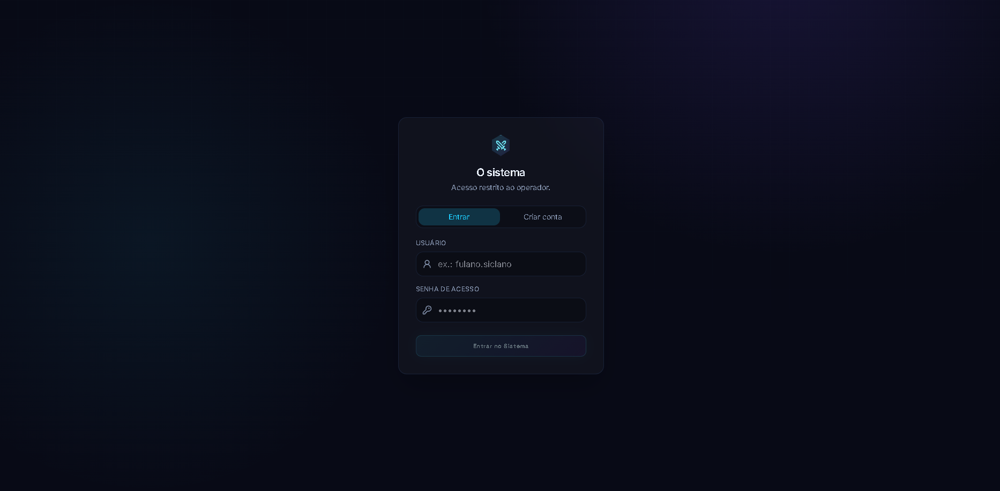
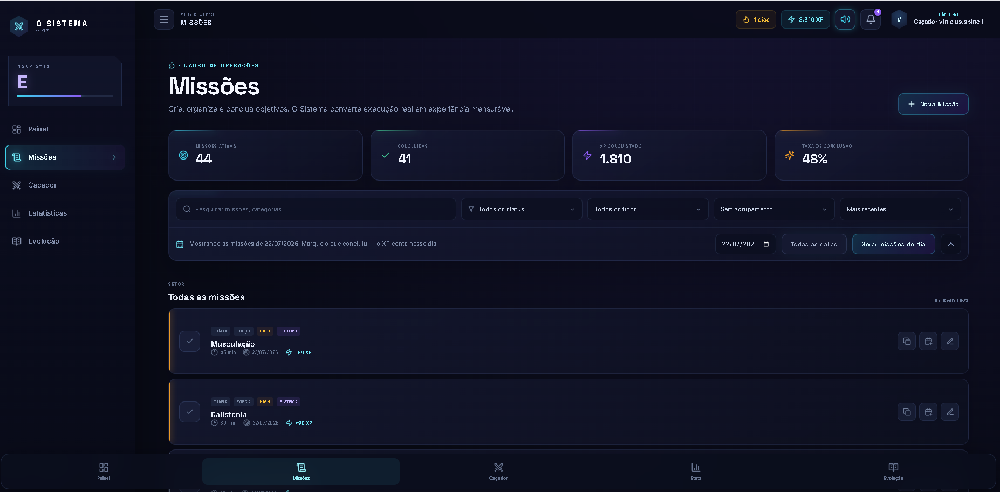
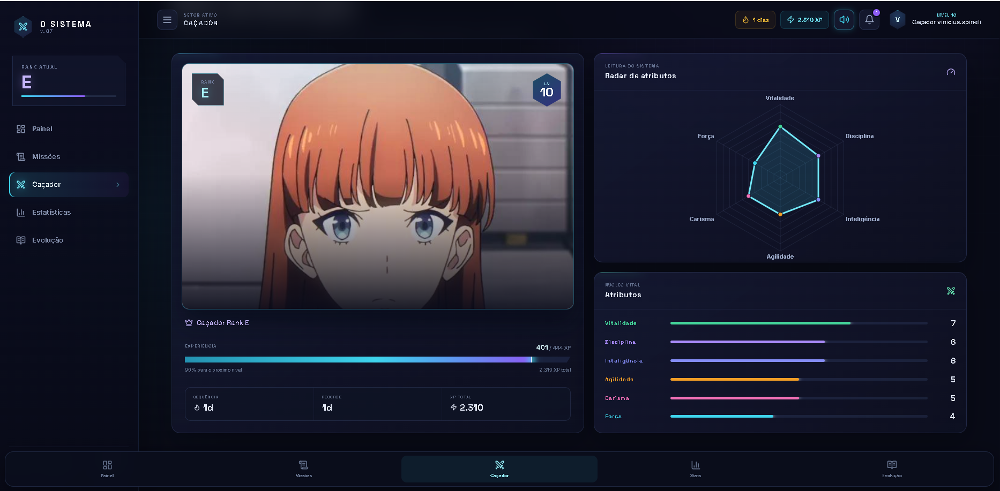
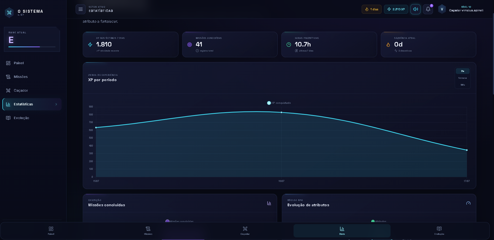
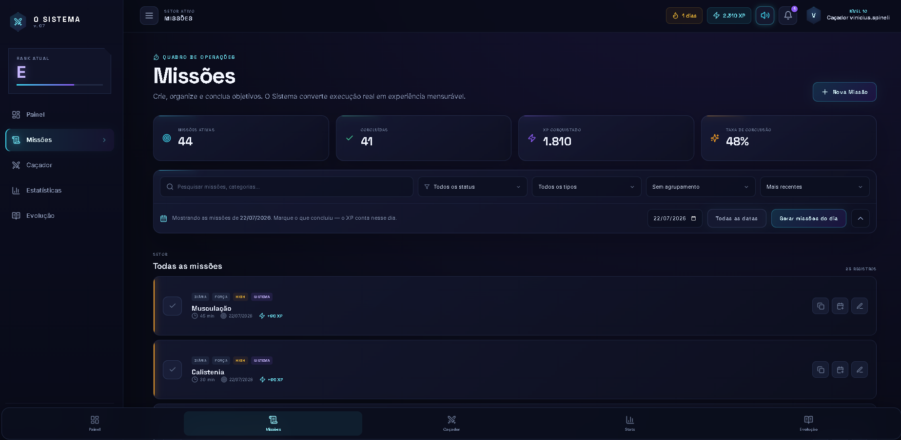

# ⚔️ Ascension System — Project Monarch

> Um **sistema RPG de produtividade pessoal** inspirado em *Solo Leveling*: transforme hábitos, estudos e treinos em XP, suba de nível, evolua atributos e ascenda de **Humano Comum** até **Monarca**.

O *Sistema* acompanha cada missão cumprida e converte disciplina em progressão: pontos de experiência, níveis, skills, atributos de RPG, bosses semanais e uma linha do tempo da sua evolução — com uma interface imersiva de vidro, brilhos arcanos e animações de *LEVEL UP*.

<p align="center">
  
  
  
  
  
  
  
</p>

---

## 📸 Login


### 🏰 Dashboard


### 📈 Estatísticas do Caçador


### 📈 Estatísticas



### 🎯 Missões
<p align="center">
  
</p>


---

## ✨ Funcionalidades

- 🏰 **Dashboard imersivo** — avatar, nível, barra de XP animada, título, rank e frase do Sistema
- 🎯 **Missões (CRUD completo)** — criar, editar, excluir, concluir, filtrar, pesquisar, agrupar, ordenar e duplicar
- 🗓️ **Missão diária do Sistema** gerada automaticamente ao abrir a aplicação
- 💪 **Atributos de RPG** — barras, ícones e histórico de evolução
- 🧠 **Skills** — nível, XP, última evolução, tempo investido e ranking
- 🔥 **Calendário de consistência** em heatmap com sequência ativa (streak)
- ⏱️ **Modo Foco (Pomodoro)** — cronômetro com seleção de skill e XP automático
- 👹 **Bosses semanais** — progresso, recompensa de XP e conquista especial
- 📜 **Timeline da Evolução** — níveis, atributos, conquistas e recordes
- 📓 **Diário de Evolução** — reflexões diárias com histórico
- 📊 **Estatísticas** com Chart.js — XP diário/semanal/mensal, skills, treinos e cardio
- 💥 **Overlay de LEVEL UP** — escurecimento, partículas, explosão de XP e novo título
- 🔔 **Notificações animadas** distintas para level up, skill, conquista, streak, título e missão do Sistema
- ♿ **Acessibilidade** — foco visível, contraste e redução opcional de movimento

### 🏆 Ranks de progressão

`👤 Humano Comum` → `E` → `D` → `C` → `B` → `A` → `S` → `🇧🇷 Rank Nacional` → `👑 Monarca`

Cada rank é desbloqueado ao atingir o nível mínimo correspondente (E: nível 8 · D: 15 · C: 25 · B: 40 · A: 60 · S: 80 · Nacional: 90 · Monarca: 100).

---

## 🛠️ Tecnologias

| Camada         | Stack                                                                |
| -------------- | -------------------------------------------------------------------- |
| **Frontend**   | React 19, TypeScript, Vite, Tailwind CSS 4, Radix UI, Framer Motion  |
| **Estado/API** | tRPC 11, TanStack Query, Wouter (rotas), Zod (validação)             |
| **Backend**    | Node.js, Express, tRPC Server, autenticação por sessão (JWT/JOSE)    |
| **Banco**      | SQLite (better-sqlite3) + Drizzle ORM                                |
| **Gráficos**   | Chart.js + react-chartjs-2, Recharts                                 |
| **Ferramentas**| pnpm, ESBuild, Vitest, Prettier                                      |

---

## 🚀 Começando

### Pré-requisitos

- [Node.js](https://nodejs.org/) **v18 ou superior**
- [pnpm](https://pnpm.io/)

> 💡 **Não precisa instalar banco de dados.** O sistema usa SQLite, um arquivo local
> (`data/ascension.db`) criado automaticamente no primeiro boot.

### Instalação

```bash
# 1. Clone o repositório
git clone <url-do-repositorio>
cd Project-Monarch

# 2. Instale as dependências
pnpm install

# 3. Crie o arquivo .env a partir do exemplo
cp .env.example .env

# 4. Inicie o servidor de desenvolvimento
pnpm dev
```

O sistema abrirá em **http://localhost:3000**

> No Windows, você também pode dar um duplo clique em `start-dev.bat`.

### Variáveis de ambiente

Copie `.env.example` para `.env` e ajuste:

```env
PORT=3000
APP_PASSWORD=troque-esta-senha          # senha inicial do admin (só no 1º boot)
APP_OWNER_NAME=Monarch
JWT_SECRET=troque-por-um-segredo-longo-e-aleatorio
# DATABASE_URL=data/ascension.db        # opcional
```

> ⚠️ **Nunca** faça commit do arquivo `.env` com segredos reais — ele já está no `.gitignore`.

---

## 📜 Scripts disponíveis

| Comando            | Descrição                                              |
| ------------------ | ------------------------------------------------------ |
| `pnpm dev`         | Inicia o servidor de desenvolvimento (client + server) |
| `pnpm build`       | Gera a build de produção                               |
| `pnpm start`       | Executa a build de produção                            |
| `pnpm check`       | Verificação de tipos com TypeScript                    |
| `pnpm test`        | Roda os testes com Vitest                              |
| `pnpm format`      | Formata o código com Prettier                          |
| `pnpm db:generate` | Gera as migrations do banco (Drizzle)                  |
| `pnpm db:push`     | Aplica o schema no banco                               |
| `pnpm db:studio`   | Abre o Drizzle Studio                                  |

---

## 📁 Estrutura do projeto

```
Project-Monarch/
├── client/          # Frontend (React + Vite)
│   ├── public/          # Ícones e imagens dos ranks (E, D, C, B, A, S, Nacional, Monarca)
│   └── src/
│       └── pages/       # Dashboard, Missions, FocusMode, Statistics, Evolution...
├── server/          # Backend (Express + tRPC)
│   ├── _core/           # contexto, auth, cookies, env, notificações
│   └── routers.ts       # auth, dashboard, missions, focus, statistics, evolution...
├── shared/          # Código compartilhado (progressão de XP, missões do Sistema, tipos)
├── drizzle/         # Schema e migrations do banco de dados
├── data/            # Banco SQLite local (gerado automaticamente)
└── package.json
```

---

## 🎮 Como funciona a progressão

O coração do Sistema está em `shared/progression.ts`:

- **XP e níveis** — cada missão, sessão de foco ou boss concede XP; a curva de XP define quando você sobe de nível.
- **Atributos & Skills** — evoluem conforme o tipo de atividade concluída (estudo, treino, cardio…).
- **Ranks** — o rank é derivado do nível atual, do Humano Comum ao Monarca.
- **Streaks & Bosses** — consistência diária alimenta a sequência ativa; bosses semanais dão recompensas extras.

As regras são cobertas por testes em `server/progression.test.ts` e `shared/progression.test.ts`.

---

## 📄 Licença

Distribuído sob a licença **MIT**.

---

<p align="center">
  <em>"Arise."</em> — Ascenda do Humano Comum ao Monarca. 👑
</p>
